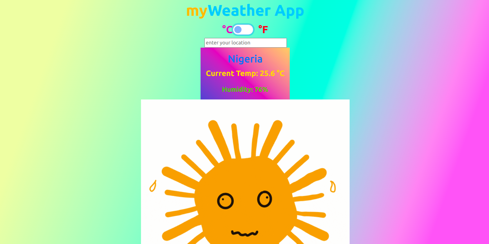

# weatherApp

> A weather application that uses real time API to forcast the weather conditions for any location



This app does the following:

- User can input location
- The app displays the weather condition for the user's location

 ## Built With

 - Major languages: HTML, CSS, and Javascript
 - Technologies: Webpacker
 - Framework; Bootstrap

## Live Demo

[Live Demo Link](https://kind-carson-bda05d.netlify.app/)

## Getting Started\*

To get a local copy up and running follow these simple example steps.

### Install

You can download the code to your personal computer clonig the repository using the following command

```
git clone https://github.com/diamond-nicholas/weatherApp.git

```

You will also have to checkout to the homepage branch and use the command `git pull` to get the lastest code.

You also need to use the command `npm install` to install all packages from the project.

### Usage

- Open the `index.html` file inside the `dist` folder using your browser of choice.
- Or you can simple run `yarn start` or `npm start` on the terminal to load the project on your default browser on port:8080

## Authors

👤 **Nicholas Diamond**

- GitHub: [@Diamond](https://github.com/diamond-nicholas)
- LinkedIn: [Diamond Nicholas](https://www.linkedin.com/in/diamond-nicholas/)
- Twitter: [@diamondnich](https://twitter.com/diamondnich)

## 🤝 Contributing

Contributions, issues, and feature requests are welcome!

Feel free to check the [issues page](https://github.com/diamond-nicholas/weatherApp/issues).

## Show your support

Give a ⭐️ if you like this project!

## 📝 License

This project is [MIT](./LICENSE) licensed.
